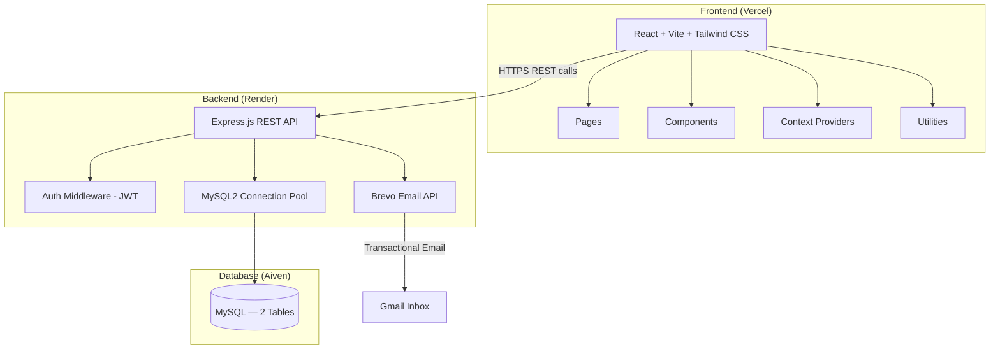
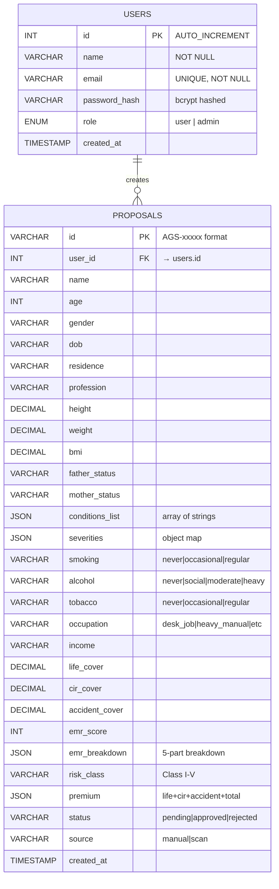
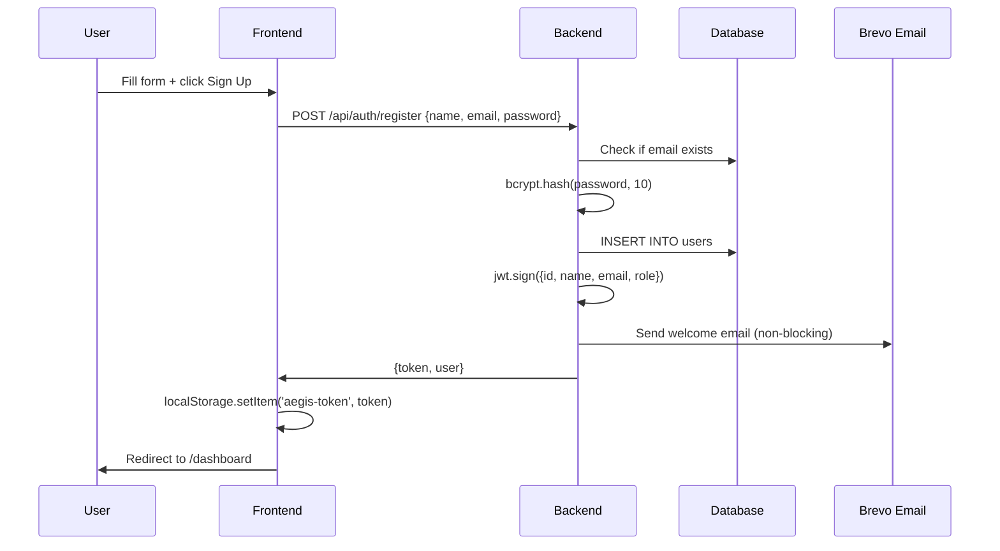
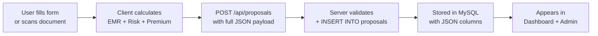

# AegisAI Insurance Platform — Complete Technical Overview

## 🏗️ Architecture



---

## 📁 Project Structure

```
Insurance/
├── client/                          # Frontend (React + Vite)
│   ├── index.html                   # Entry HTML (Tailwind CDN + fonts)
│   ├── src/
│   │   ├── App.jsx                  # Router + Layout + Protected Routes
│   │   ├── App.css                  # Global styles
│   │   ├── main.jsx                 # React DOM entry
│   │   ├── pages/
│   │   │   ├── LoginPage.jsx        # Premium glassmorphism login/register
│   │   │   ├── HomePage.jsx         # Marketing landing page
│   │   │   ├── DashboardPage.jsx    # User proposals dashboard
│   │   │   ├── ProposalPage.jsx     # 8-step proposal form wizard
│   │   │   ├── ScanPage.jsx         # Digital form + OCR scanner
│   │   │   └── AdminPage.jsx        # Admin panel (all proposals)
│   │   ├── components/
│   │   │   ├── Navbar.jsx           # Main navigation + settings panel
│   │   │   ├── PillNav.jsx + .css   # Mobile pill-style navigation
│   │   │   ├── SplitText.jsx        # Animated text component (GSAP-like)
│   │   │   └── RotatingText.jsx     # Rotating text animation
│   │   ├── context/
│   │   │   ├── AuthContext.jsx      # Authentication state (login/register/logout)
│   │   │   └── AppContext.jsx       # App settings (theme/currency/language)
│   │   ├── utils/
│   │   │   ├── api.js               # All API calls + token management
│   │   │   └── emr.js               # EMR calculation + risk + premium
│   │   └── i18n/
│   │       └── translations.js      # Multi-language (EN/HI) + currency formatting
│
├── server/                          # Backend (Node.js + Express)
│   ├── server.js                    # All API routes (611 lines)
│   ├── setup-db.js                  # Database schema creation script
│   ├── package.json                 # Backend dependencies
│   └── .env                         # Environment variables
```

---

## 🧩 Components Breakdown

| Component | Purpose | Key Tech |
|---|---|---|
| [LoginPage.jsx](file:///c:/Users/deogh/OneDrive/Desktop/Insurance/client/src/pages/LoginPage.jsx) | Login / Register / Forgot Password | Glassmorphism, Split-screen |
| [HomePage.jsx](file:///c:/Users/deogh/OneDrive/Desktop/Insurance/client/src/pages/HomePage.jsx) | Marketing landing page | Animations, Hero section |
| [DashboardPage.jsx](file:///c:/Users/deogh/OneDrive/Desktop/Insurance/client/src/pages/DashboardPage.jsx) | View/manage user's proposals | Stats cards, Search, Export |
| [ProposalPage.jsx](file:///c:/Users/deogh/OneDrive/Desktop/Insurance/client/src/pages/ProposalPage.jsx) | 8-step new proposal wizard | Multi-step form, EMR calc |
| [ScanPage.jsx](file:///c:/Users/deogh/OneDrive/Desktop/Insurance/client/src/pages/ScanPage.jsx) | Digital form + OCR scan | Tesseract.js, Canvas crop |
| [AdminPage.jsx](file:///c:/Users/deogh/OneDrive/Desktop/Insurance/client/src/pages/AdminPage.jsx) | Admin manage all proposals | Edit/Delete, Status update |
| [Navbar.jsx](file:///c:/Users/deogh/OneDrive/Desktop/Insurance/client/src/components/Navbar.jsx) | Navigation + Settings panel | Dark mode, Currency, Language |
| [AuthContext.jsx](file:///c:/Users/deogh/OneDrive/Desktop/Insurance/client/src/context/AuthContext.jsx) | Auth state management | JWT token, localStorage |
| [AppContext.jsx](file:///c:/Users/deogh/OneDrive/Desktop/Insurance/client/src/context/AppContext.jsx) | App preferences state | Theme, Currency, Language |

---

## 🗄️ Database Schema (MySQL)



---

## 🧮 EMR Algorithm (Core Business Logic)

The **Extra Mortality Rating** is calculated in [emr.js](file:///c:/Users/deogh/OneDrive/Desktop/Insurance/client/src/utils/emr.js):

```
Total EMR = Base(100) + Family + Health + Lifestyle + Occupation
```

| Factor | Data Structure | Values |
|---|---|---|
| **Base** | Fixed | Always `100` |
| **Family** | `{fatherStatus, motherStatus}` → lookup map | `alive_healthy: 0`, `deceased_before_60: +50` |
| **Health** | `conditions[]` + `severities{}` | Each condition has base weight × severity multiplier |
| **Lifestyle** | `{smoking, alcohol, tobacco}` → 3 lookup maps | `never: 0` → `regular/heavy: +30-40` |
| **Occupation** | `occupation` → lookup map | `desk_job: 0` → `extreme_risk: +50` |

### Risk Classification
| EMR Range | Class | Label |
|---|---|---|
| ≤ 90 | Class I | Lowest Risk 🟢 |
| 91-110 | Class II | Low Risk 🟡 |
| 111-130 | Class III | Moderate Risk 🟠 |
| 131-150 | Class IV | High Risk 🔴 |
| > 150 | Class V | Highest Risk ⛔ |

### Premium Formula
```
Life Premium = lifeCover × 0.5% × (EMR / 100)
CIR Premium  = cirCover  × 0.8% × (EMR / 100)
Accident     = accidentCover × 0.3% (flat rate)
```

---

## 🔐 Authentication Flow



---

## 🌐 API Endpoints

| Method | Endpoint | Auth | Purpose |
|---|---|---|---|
| `POST` | `/api/auth/register` | ❌ | Create account + send welcome email |
| `POST` | `/api/auth/login` | ❌ | Login + return JWT |
| `POST` | `/api/auth/forgot-password` | ❌ | Send temp password via email |
| `GET` | `/api/auth/me` | ✅ | Get current user profile |
| `PUT` | `/api/auth/me` | ✅ | Update profile name |
| `DELETE` | `/api/auth/me` | ✅ | Delete account |
| `POST` | `/api/auth/change-password` | ✅ | Change password |
| `GET` | `/api/proposals` | ✅ | Get user's proposals |
| `POST` | `/api/proposals` | ✅ | Create new proposal |
| `PUT` | `/api/proposals/:id` | ✅ | Update proposal |
| `DELETE` | `/api/proposals/:id` | ✅ | Delete proposal |
| `GET` | `/api/admin/proposals` | ✅ | Get ALL proposals (admin) |
| `PUT` | `/api/admin/proposals/:id` | ✅ | Update any proposal (admin) |
| `DELETE` | `/api/admin/proposals/:id` | ✅ | Delete any proposal (admin) |
| `GET` | `/api/admin/stats` | ✅ | Dashboard statistics |
| `GET` | `/api/health` | ❌ | Server + DB health check |
| `GET` | `/api/diag` | ❌ | Config diagnostics |

---

## 🛠️ Tech Stack

| Layer | Technology | Why |
|---|---|---|
| **Frontend** | React 18 + Vite | Fast dev + HMR |
| **Styling** | Tailwind CSS (CDN) + Vanilla CSS | Utility-first + custom styles |
| **Animations** | Framer Motion | Page transitions + micro-animations |
| **Icons** | Material Symbols + Lucide React | Two icon systems |
| **OCR** | Tesseract.js | Client-side document scanning |
| **Backend** | Express.js (Node.js) | REST API server |
| **Database** | MySQL (Aiven cloud) | Relational data with JSON columns |
| **Auth** | JWT + bcryptjs | Stateless auth + password hashing |
| **Email** | Brevo (Sendinblue) API | Transactional emails |
| **Frontend Host** | Vercel | Auto-deploy from GitHub |
| **Backend Host** | Render (Free Tier) | Auto-deploy from GitHub |
| **DB Host** | Aiven (Free Tier) | Managed MySQL with SSL |

---

## 🔄 Data Flow: Proposal Submission



### Proposal JSON (sent to backend):
```json
{
  "id": "AGS-M3X7KP",
  "name": "Sourav", "age": 23, "gender": "male",
  "dob": "2002-05-12", "residence": "urban",
  "profession": "Software Engineer",
  "height": 175, "weight": 72, "bmi": 23.5,
  "income": "1200000",
  "conditions": ["hypertension"],
  "severities": { "hypertension": 2 },
  "smoking": "never", "alcohol": "social", "tobacco": "never",
  "occupation": "desk_job",
  "lifeCover": 5000000, "cirCover": 1000000, "accidentCover": 2500000,
  "emrScore": 117,
  "emrBreakdown": { "base": 100, "family": 0, "health": 12, "lifestyle": 5, "occupation": 0 },
  "riskClass": "Class III",
  "premium": { "life": 29250, "cir": 9360, "accident": 7500, "total": 46110 },
  "status": "pending",
  "source": "manual"
}
```

---

## 🌍 i18n & Settings

- **Languages:** English ([en](file:///c:/Users/deogh/OneDrive/Desktop/Insurance/client/src/utils/api.js#3-4)) + Hindi (`hi`) — stored in [translations.js](file:///c:/Users/deogh/OneDrive/Desktop/Insurance/client/src/i18n/translations.js)
- **Currencies:** INR (₹), USD ($), EUR (€), GBP (£)
- **Theme:** Light / Dark mode (CSS class toggle)
- **Persistence:** All saved to `localStorage` (`aegis-theme`, `aegis-currency`, `aegis-lang`)
